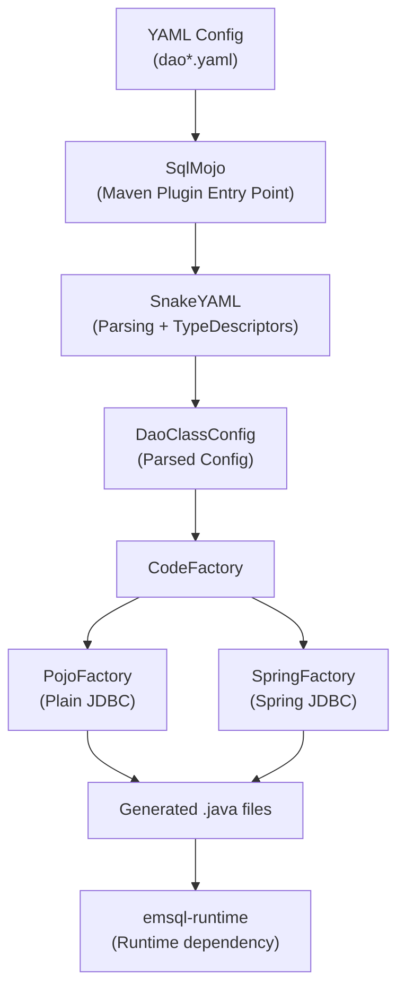
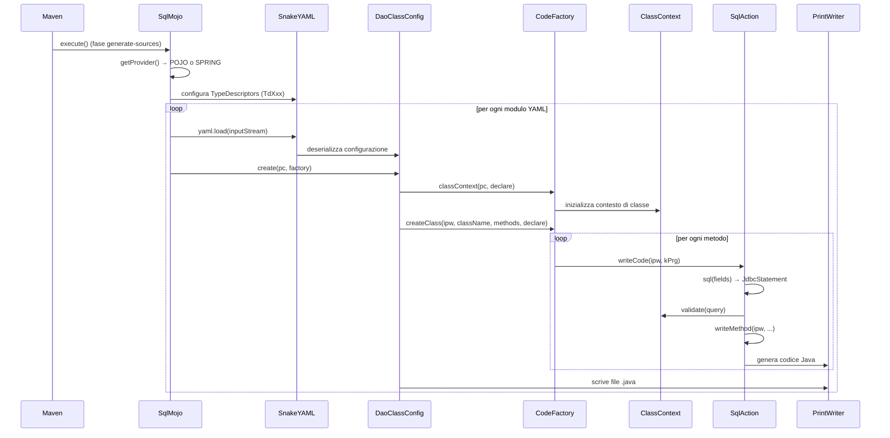

# Analisi del progetto `emsql-maven-plugin`

## Panoramica

**emsql-maven-plugin** è un plugin Maven che genera codice sorgente Java JDBC a partire da template YAML. Produce automaticamente classi **DAO** (Data Access Object) e interfacce **DTO** (Data Transfer Object) per l'accesso ai dati via JDBC.

| Proprietà | Valore |
|---|---|
| **GroupId** | `io.github.epi155` |
| **ArtifactId** | `emsql-maven-plugin` |
| **Versione** | `1.1-A4-SNAPSHOT` |
| **Java target** | 11 |
| **Licenza** | GNU LGPL 3 |
| **Autore** | Enrico Pistolesi |

---

## Architettura ad alto livello

---

## Struttura dei package

Il codice sorgente principale risiede sotto `io.github.epi155.emsql` ed è organizzato in **8 package**:

### Package principali

| Package | Ruolo | File |
|---|---|---|
| `plugin` | Entry point Maven (Mojo), parsing YAML, configurazione DAO | 6 classi + sotto-package `td` |
| `api` | Interfacce pubbliche e contratti (SPI-like) | 31 file (interfacce/modelli) |
| `commons` | Logica condivisa di generazione codice | 26 classi + sotto-package `dml`, `dpl`, `dql` |
| `pojo` | Implementazione **Pojo** (JDBC puro, classi statiche) | 3 classi + `dml`, `dpl`, `dql` |
| `spring` | Implementazione **Spring** (Repository + DataSource injection) | 3 classi + `dml`, `dpl`, `dql` |
| `types` | Mapping dei tipi SQL → Java (**84 classi**) | 42 coppie `*StdType` / `*NilType` |
| `provider` | Enum `ProviderEnum` (POJO / SPRING) | 1 classe |
| `spi` | SPI per parser SQL custom esterni | 2 interfacce |

### Sotto-package per categoria SQL

Sia `commons`, `pojo` che `spring` hanno tre sotto-package che rispecchiano le categorie SQL:

| Sotto-package | Categoria | Operazioni |
|---|---|---|
| `dml` | Data Manipulation Language | Insert, Update, Delete (+ Batch + InsertReturnGeneratedKeys) |
| `dpl` | Data Procedure Language | CallProcedure, InlineProcedure, CallBatch, InlineBatch, Command |
| `dql` | Data Query Language | SelectSingle, SelectOptional, SelectList, CursorForSelect, SelectListDyn, CursorForSelectDyn |

---

## Matrice delle operazioni SQL supportate

| Operazione | Template YAML | Pojo | Spring | Batch |
|---|---|---|---|---|
| `SelectSingle` | `!SelectSingle` | ✅ | ✅ | — |
| `SelectOptional` | `!SelectOptional` | ✅ | ✅ | — |
| `SelectList` | `!SelectList` | ✅ | ✅ | — |
| `CursorForSelect` | `!CursorForSelect` | ✅ | ✅ | — |
| `SelectListDyn` | `!SelectListDyn` | ✅ | ✅ | — |
| `CursorForSelectDyn` | `!CursorForSelectDyn` | ✅ | ✅ | — |
| `Insert` | `!Insert` | ✅ | ✅ | ✅ |
| `Update` | `!Update` | ✅ | ✅ | ✅ |
| `Delete` | `!Delete` | ✅ | ✅ | ✅ |
| `InsertReturnGeneratedKeys` | `!InsertKey` | ✅ | ✅ | — |
| `CallProcedure` | `!CallProc` | ✅ | ✅ | ✅ |
| `InlineProcedure` | `!InlineProc` | ✅ | ✅ | ✅ |
| `Command` | `!Command` | ✅ | ✅ | — |

---

## Pipeline di generazione codice

---

## Design Patterns utilizzati

| Pattern | Dove | Descrizione |
|---|---|---|
| **Abstract Factory** | `CodeFactory` / `PojoFactory` / `SpringFactory` | Crea le istanze concrete dei modelli per ogni operazione SQL |
| **Provider / SPI** | `ProviderEnum` + `CodeProvider` | Seleziona il provider di generazione (Pojo vs Spring) |
| **Template Method** | `BasicFactory.createClass()` + `classBegin()` | Il flusso di creazione della classe è definito nella superclasse, i dettagli nelle sottoclassi |
| **Strategy** | `SqlAction` sottoclassi per ogni tipo di operazione | Ogni operazione ha la propria strategia di generazione |
| **Delegation** | classi `Delegate*` in `commons/dml`, `commons/dpl`, `commons/dql` | Logica comune delegata a classi specifiche |
| **Type Object** | 84 classi in `types/` | Ogni tipo SQL è rappresentato da una coppia di classi (Std/Nil) |
| **ThreadLocal Context** | `Contexts.cc`, `Contexts.mc` + `SqlMojo.mapContext` | Contesto di classe e metodo condiviso via thread-local |

---

## Sistema dei tipi SQL (84 classi)

Ogni tipo SQL è mappato da una coppia di classi:
- **`*StdType`** — tipo NOT NULL (primitivo Java quando possibile)
- **`*NilType`** — tipo NULLABLE (wrapper Java)

### Categorie di tipi supportati

| Categoria | Tipi | Esempio Java |
|---|---|---|
| **Numerici** | `int`, `long`, `short`, `byte`, `float`, `double`, `Number`, `Decimal` | `int` / `Integer`, `BigDecimal` |
| **Stringa** | `VarChar`, `NVarChar`, `Char`, `NChar`, `FixedChar` | `String` |
| **Long String** | `LongVarChar`, `LongNVarChar` (+ Stream variants) | `String`, `Reader` |
| **Binari** | `Binary`, `VarBinary`, `LongVarBinary` (+ Stream variants) | `byte[]`, `InputStream` |
| **Data/Ora** | `Date`, `Time`, `Timestamp`, `LocalDate`, `LocalTime`, `LocalDateTime` | `java.sql.Date`, `java.time.*` |
| **Data/Ora con timezone** | `TimeZ`, `TimestampZ` | `OffsetTime`, `OffsetDateTime` |
| **LOB** | `Blob`, `Clob`, `NClob`, `BlobStream`, `ClobStream`, `NClobStream` | `Blob`, `Clob`, `Reader`, `InputStream` |
| **Boolean** | `Boolean`, `BooleanNil`, `NumBool` | `boolean` / `Boolean` |
| **Speciali** | `Array`, `Ref`, `RowId`, `SQLXML`, `URL` | `Array`, `Ref`, `RowId`, `SQLXML`, `URL` |

---

## Parametri del plugin Maven

| Parametro | Default | Descrizione |
|---|---|---|
| `modules` | (obbligatorio) | Lista di file YAML da processare |
| `generateDirectory` | `target/generated-sources/emsql` | Directory output del codice generato |
| `configDirectory` | `src/main/resources` | Directory dei file YAML di configurazione |
| `debugCode` | `true` | Genera codice di debug/trace SQL |
| `provider` | `Pojo` | Provider: `Pojo` o `Spring` |
| `java7` | `false` | Compatibilità Java 7 (usa `ESupplier`/`EConsumer` dal runtime) |
| `autoPad` | `false` | Padding automatico per tipi `CHAR(n)` |
| `parserProvider` | `null` | Provider SPI per validatore SQL custom |
| `addCompileSourceRoot` | `true` | Aggiunge la directory generata come source root |
| `addTestCompileSourceRoot` | `false` | Aggiunge come test source root |

---

## Dipendenze principali

### Compile-time
| Dipendenza | Versione | Ruolo |
|---|---|---|
| `snakeyaml` | 2.6 | Parsing file YAML |
| `maven-plugin-api` | 3.9.14 | API Maven plugin (provided) |
| `maven-core` | 3.9.14 | Core Maven (provided) |
| `maven-plugin-annotations` | 3.15.2 | Annotazioni `@Mojo`, `@Parameter` |
| `lombok` | 1.18.44 | Riduzione boilerplate |
| `slf4j-api` | 2.0.17 | Logging |
| `jetbrains-annotations` | 26.1.0 | `@NotNull`, `@Nullable` |
| `commons-text` | 1.15.0 | Utilità stringa (CamelCase) |
| `commons-lang3` | 3.20.0 | Utilità generiche |

### Test-time
| Dipendenza | Versione | Ruolo |
|---|---|---|
| `emsql-runtime` | 1.1-A4-SNAPSHOT | Runtime per compilare il codice generato |
| `junit-jupiter` | 5.14.3 | Framework di test |
| `maven-plugin-testing-harness` | 3.5.1 | Test del plugin Maven |
| `spring-jdbc` / `spring-context` | 5.3.39 | Test del provider Spring |
| `logback-classic` | 1.5.32 | Logging nei test |

---

## Suite di test

| Categoria | Classe | Descrizione |
|---|---|---|
| **Unit** | `SqlMojoTest` | Test del Mojo con configurazioni YAML multiple |
| **Unit** | `PathTraversalTest` | Verifica protezione path traversal |
| **Regression** | `SnapshotTest` | Test snapshot-based per verificare stabilità dell'output generato |
| **Regression** | `DqlRegressionTest` | Regressione specifica per operazioni DQL |
| **Integration** | `CompilationTest` | Verifica compilabilità del codice generato |
| **Utilities** | `CompilationTester`, `GeneratedCodeValidator`, `SnapshotManager`, `TestResourceManager` | Infrastruttura di supporto ai test |

Le risorse di test includono **61 file YAML** (`dao*.yaml`, `ooSelect*.yaml`) che coprono tutti i tipi SQL e tutte le operazioni supportate, più directory `regression/`, `snapshots/` e `unit/` per i dati di test.

---

## Differenze tra i due Provider

| Aspetto | **Pojo** | **Spring** |
|---|---|---|
| Classe generata | `public class` con costruttore privato | `@Repository public class` |
| Metodi | `static` con parametro `Connection c` | Metodi d'istanza, `DataSource` iniettato via `@Autowired` |
| Connessione | Passata esplicitamente dal chiamante | Ottenuta dal `DataSource` |
| Transazioni | Gestite dal chiamante | Per le query dinamiche usa `PlatformTransactionManager` |
| Qualifier | Non supportato | Supportato via campo `qualifier` nel YAML |

---

## Statistiche del codice

| Metrica | Valore |
|---|---|
| File Java (main) | ~145 |
| File Java (test) | ~8 + 4 utility |
| File YAML di test | 61 |
| Tipi SQL supportati | 42 coppie (84 classi) |
| Operazioni SQL supportate | 13 (+ varianti batch) |
| Documentazione | 30 file markdown in `doc/` |
